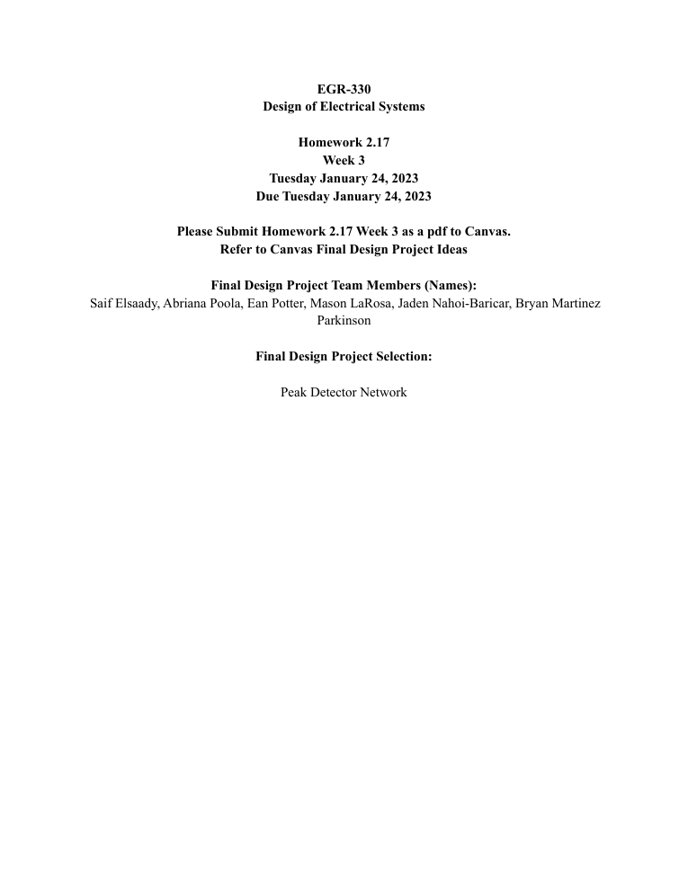

# Design of Electrical Systems — Labs & Final Design Project

> Coursework project from **EGR 330: Design of Electrical Systems (2023 Spring)** (2023 Spring C).

**Course:** EGR 330: Design of Electrical Systems (2023 Spring) — 2023 Spring C  ·  **Area:** hardware, design

## Overview
This repository contains my submitted deliverables for the project below. The course assignment brief (verbatim, abbreviated):

> PPT Grading Rubric.docx PPT Grading Rubric.docx Final Design Project Report Rubric

## Tools & Tech
- PDF report
- presentation

## Repository Structure
```
docs/2023-02-07_15-32-1.pdf
docs/2023-03-12_15-15.pdf
docs/EGR330_FINAL_PRESENTATION.pptx
docs/EGR330_Report.pdf
docs/EGR_330_Final_Design_Project_Idea.pdf
docs/Laboratory_1.17_Week_1.docx
docs/Laboratory_2.17_Week_3.docx_1_.pdf
docs/Laboratory_3.17_Week_5.docx.pdf
docs/Laboratory_4.17_Week_7.docx.pdf
images/preview.png
```

## Results
See the report(s)/presentation(s) in `docs/` — e.g. `docs/Laboratory_1.17_Week_1.docx`.

## Preview


## License
Released under the MIT License — see `LICENSE`.

---
_Part of my engineering coursework portfolio. Deliverables only; routine homework, quizzes, and exams are intentionally excluded._